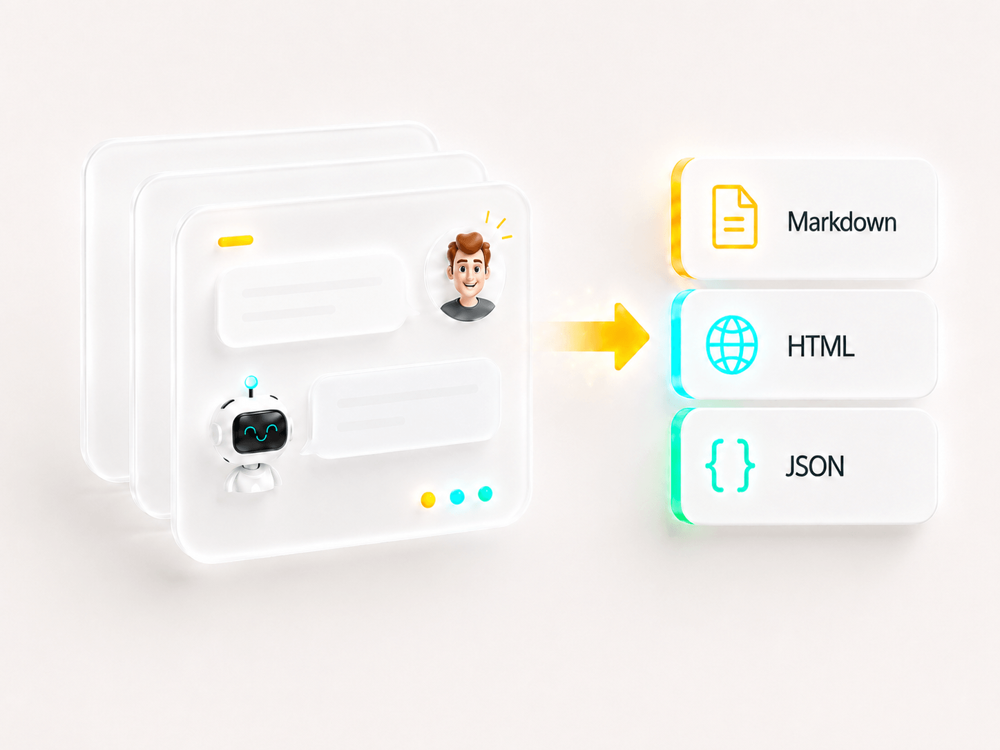
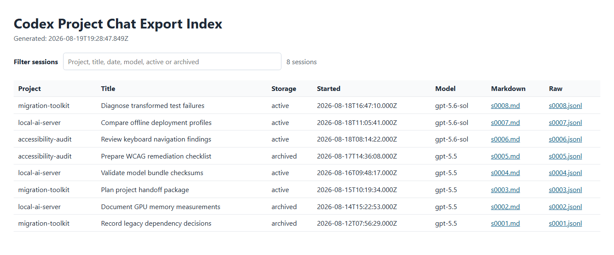
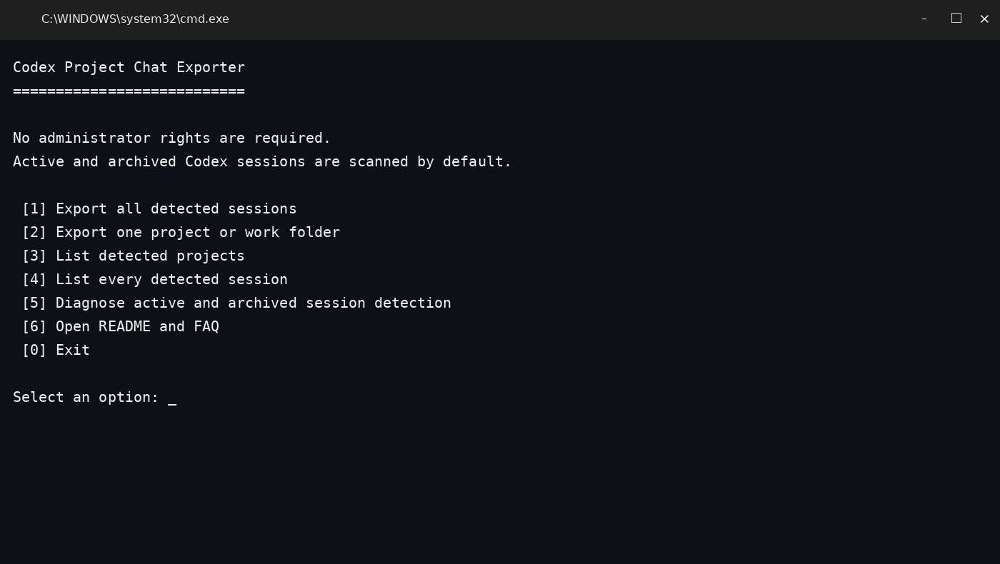
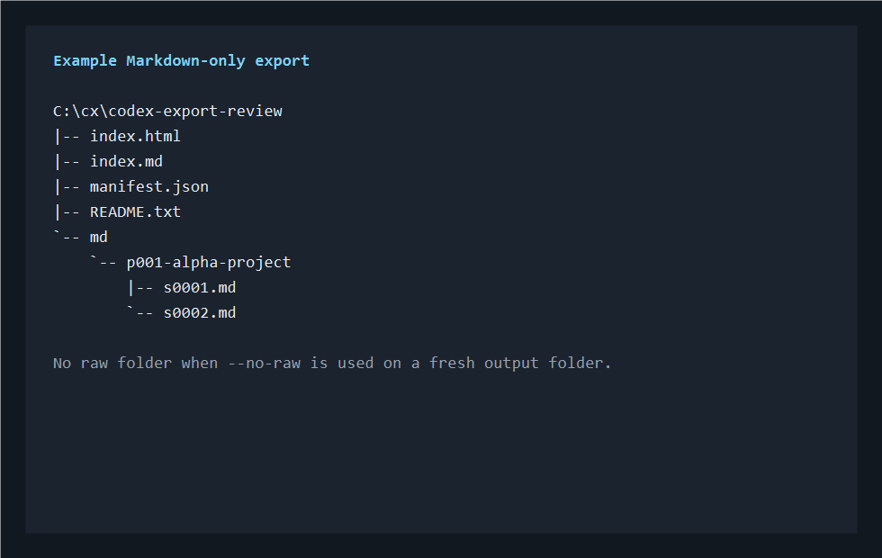

# Codex Project Chat Exporter



Bulk-export local Codex session history into a portable, project-aware archive.

The exporter scans Codex session files on disk, groups them by their stored project/work folder, and writes:

- readable Markdown transcripts
- a local HTML index with metadata filtering
- a machine-readable `manifest.json`
- optional copies of the original `rollout-*.jsonl` files

It is designed primarily for **backup, computer moves, project handoff, and long-term local archiving** – not as a live Codex replacement or a full-text search platform.

> Unofficial project. Not affiliated with, endorsed by, or supported by OpenAI.

## What it looks like



<p>
  
  
</p>

All screenshots contain synthetic demo data only.

## Why this tool exists

Codex stores local session history in technical JSONL event logs. Those files are valuable, but they are awkward to review and easy to lose sight of when projects span many sessions or when a computer is replaced.

Codex Project Chat Exporter creates one self-contained archive across projects. It reads both active and archived local sessions by default and does not require the original project folders to still exist.

## Design focus

This repository deliberately solves a narrower problem than the larger Codex session tools already available.

| Tool category | Strong at | This project differs by |
| --- | --- | --- |
| Single-session exporters | Precise export of one selected conversation | Bulk export across all detected projects and sessions |
| Interactive viewers and TUIs | Rich browsing, replay, filtering, and detailed event inspection | Static output that remains usable without the tool |
| Multi-agent search platforms | Search across Codex, Claude, Cursor, and other agents | Codex-specific migration archive with optional original JSONL copies |
| Obsidian integrations | Writing session notes directly into a vault | Standalone folder archive with no knowledge-base dependency |

The intended result is not the most feature-rich session browser. It is a **small, reviewable migration and archive utility** with a Windows-friendly launcher.

## Features

- Scans `~/.codex/sessions` and `~/.codex/archived_sessions` by default.
- Groups sessions by the stored Codex working directory (`cwd`).
- Lists either unique project/work folders with active/archived counts or every individual session.
- Exports all sessions or only one matching project/work folder.
- Produces readable Markdown containing user and assistant messages.
- Optionally includes tool calls and tool outputs.
- Copies complete raw JSONL files unless `--no-raw` is used.
- Creates a local `index.html` filterable by project, title, date, model, and active/archived status.
- Uses a thread title from `session_index.jsonl` when available and otherwise derives a short fallback from the first user message.
- Recovers a session ID from standard `rollout-...-<id>.jsonl` filenames when an archived file has incomplete or malformed `session_meta`.
- Provides a diagnostic view for files with missing `cwd`, missing titles, invalid JSON lines, or contradictory IDs.
- Uses short output paths by default to reduce Windows path-length problems.
- Refuses to write private exports into the tool/repository folder unless explicitly overridden.
- Runs locally and makes no network requests.
- Has no runtime dependencies beyond Node.js.

## Boundaries

This project does **not**:

- export cloud-only Codex tasks that have no local session file
- export ordinary ChatGPT web conversations
- import sessions back into Codex
- recreate Codex UI state, project registration, or sidebar history
- provide transcript full-text search inside `index.html`
- extract image attachments into separate files
- guarantee complete removal of secrets or personal data

The generated HTML index filters session metadata. To search transcript content, use your editor, operating-system search, or another dedicated session-search tool across the exported Markdown files.

Codex's local file format is internal and may change. This exporter is a best-effort parser for the currently observed `rollout-*.jsonl` structure.

## Requirements

- Node.js 18 or newer
- Windows, macOS, or Linux for the Node.js script
- Windows users may use the included `.cmd` launcher

No package installation is required.

## Quick start on Windows

The exporter itself does not require administrator rights.

When the repository was downloaded as a ZIP, Windows may mark the archive and extracted script files as originating from the internet. On systems with Smart App Control or Attachment Manager enforcement, this can block the `.cmd` launcher before it starts.

Preferred fix:

1. Right-click the downloaded ZIP and select **Properties**.
2. Select **Unblock** / **Zulassen**, then **Apply**.
3. Extract the ZIP again.

If the folder has already been extracted, open PowerShell in its parent folder and run:

```powershell
Get-ChildItem .\codex-project-chat-exporter -Recurse -File | Unblock-File
```

Do not use **Run as administrator** as the normal workaround. The launcher only needs access to your own Codex files and the selected output folder.

Afterwards, double-click:

```text
export-codex-project-chats.cmd
```

The launcher opens a numbered menu. No command needs to be typed into or added to the `.cmd` file. Available actions include:

1. export all detected sessions
2. export one project/work folder
3. list detected projects
4. list every detected session
5. diagnose active and archived session detection

The export actions then ask whether raw JSONL files should be omitted and where the archive should be written.

A short output path is recommended, for example:

```text
C:\cx\codex-export
```

## Command line

List unique project/work folders and active/archived session counts:

```powershell
node .\bin\export-codex-project-chats.mjs --list
```

Sessions with the same stored working directory are grouped on one project line, even when one is active and another is archived. List every session separately, including title, storage status, ID, and source filename:

```powershell
node .\bin\export-codex-project-chats.mjs --list-sessions
```

Diagnose scan paths, file counts, incomplete metadata, and parser warnings:

```powershell
node .\bin\export-codex-project-chats.mjs --diagnose
```

Windows users can select the equivalent **List every detected session** or **Diagnose** entries directly from the launcher menu.

Export all local sessions:

```powershell
node .\bin\export-codex-project-chats.mjs --all --out C:\cx\codex-export
```

Export all sessions without raw JSONL copies:

```powershell
node .\bin\export-codex-project-chats.mjs --all --no-raw --out C:\cx\codex-export-md
```

Export one project/work folder:

```powershell
node .\bin\export-codex-project-chats.mjs --project my-project --out C:\cx\my-project-export
```

Use another local Codex profile:

```powershell
node .\bin\export-codex-project-chats.mjs --codex-home "C:\Users\<you>\.codex-local" --all --out C:\cx\local-profile-export
```

Exclude archived sessions:

```powershell
node .\bin\export-codex-project-chats.mjs --all --no-archived --out C:\cx\active-only
```

Include tool calls and tool outputs in Markdown:

```powershell
node .\bin\export-codex-project-chats.mjs --all --include-tools --out C:\cx\codex-export-with-tools
```

Show all options:

```powershell
node .\bin\export-codex-project-chats.mjs --help
```

## Output structure

Default short-path export:

```text
cx-YYYYMMDD-HHMMSS\
├─ index.html
├─ index.md
├─ manifest.json
├─ README.txt
├─ md\
│  ├─ p001-project-a\
│  │  ├─ s0001.md
│  │  └─ s0002.md
│  └─ p002-project-b\
│     └─ s0003.md
└─ raw\
   ├─ p001-project-a\
   │  ├─ s0001.jsonl
   │  └─ s0002.jsonl
   └─ p002-project-b\
      └─ s0003.jsonl
```

`raw/` is omitted when `--no-raw` is used on a clean output folder.

Use `--readable-paths` for longer filenames based on timestamps and titles. Short paths are the safer default for copying and unzipping archives on Windows.

## Privacy and redaction

All processing is local. The exporter does not call OpenAI APIs, request a ChatGPT data export, upload files, or send telemetry.

Markdown output applies a small set of best-effort redaction patterns for common token-shaped secrets and long base64-like values. This is only a safety aid. It does not make an export safe to publish.

Even redacted Markdown and index files may still contain:

- prompts and responses
- project names and local paths
- names, email addresses, IP addresses, or customer data
- terminal and tool output
- proprietary source code or internal instructions

Raw JSONL copies are unchanged and should be treated as sensitive. Review every generated file before sharing it. See [SECURITY.md](SECURITY.md).

## Existing output folders

The exporter does not delete files from an existing output folder. Reusing a folder can therefore leave old files behind – including a previous `raw/` directory.

For a clean archive, choose a new output folder or delete the old one before running the exporter.

## Testing

Run:

```powershell
npm test
```

The test suite covers helper functions and an end-to-end export with active and archived synthetic sessions.

## Release status

Current version: `0.1.0`

See [CHANGELOG.md](CHANGELOG.md).

## License

MIT – see [LICENSE](LICENSE).
