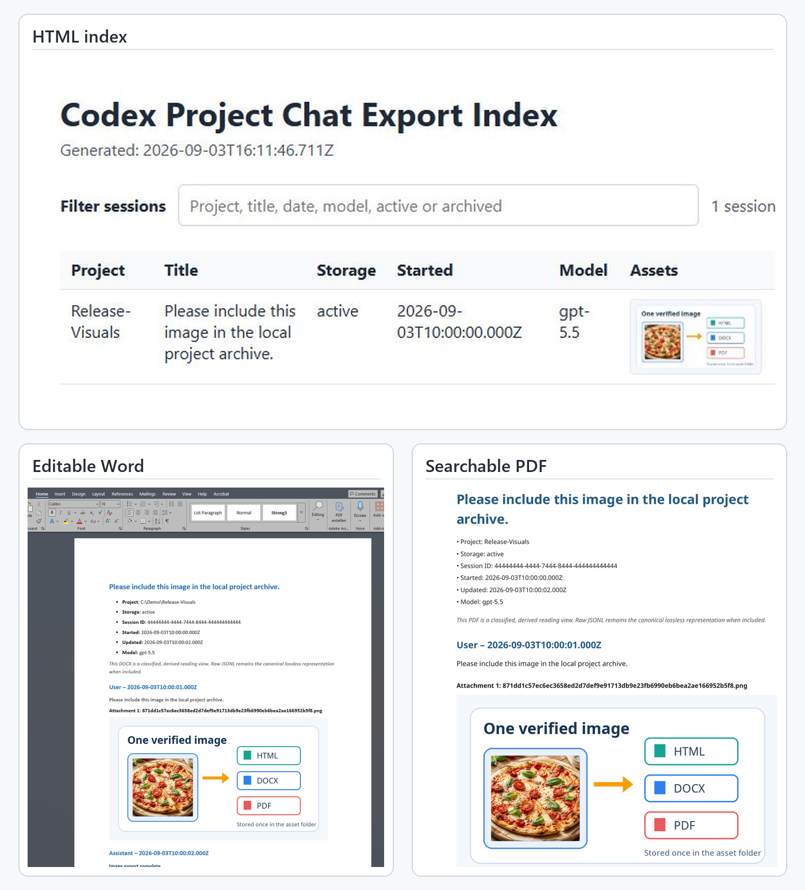

# Codex Project Chat Exporter

Export local Codex project history into independent, portable archives – including editable Word documents and searchable PDFs.

[](https://github.com/Ann-Diana/codex-project-chat-exporter/releases/latest)
[](#choose-how-to-run)
[](LICENSE)
[](https://github.com/Ann-Diana/codex-project-chat-exporter/actions/workflows/test.yml)

<p>
  
</p>

> **Direct DOCX and PDF generation – locally, from the same readable document model, without Word, LibreOffice or cloud conversion.**

Markdown, HTML, DOCX and PDF follow the same selected session content in the same order. Selected images appear inline and also remain in the deduplicated asset folder.

- Export the current workspace, another recorded project or all local sessions.
- Reconstruct paginated fork histories from validated local rollout references.
- Get Markdown, responsive HTML, manifests and optional verified source snapshots.
- Local and read-only toward original Codex data. No telemetry, import or repair.

> Unofficial project. Not affiliated with, endorsed by or supported by OpenAI.

## Requirements

All entry points require local Codex session data.

- **VS Code extension:** VS Code Desktop 1.101+ and the packaged VSIX. No separate Node.js installation is required.
- **Windows launcher:** a prepared project checkout with package dependencies installed. At runtime, the launcher uses Node.js 22+ from `PATH` or the known Codex Desktop runtime.
- **Direct CLI:** Node.js 22+ and installed package dependencies.

DOCX and PDF generation does not require Microsoft Word or LibreOffice.

## See the output

The Windows launcher, VS Code extension and direct Node.js CLI use the same export core. The following outputs use synthetic demo data and can be created through any of these entry points.

<p>
  <a href="docs/screenshots/export-output-overview.png"></a>
</p>

Full-size originals: [HTML index](docs/screenshots/export-html-images.png) · [Editable Word](docs/screenshots/export-docx-images.png) · [Searchable PDF](docs/screenshots/export-pdf-images.png)

## Choose how to run

| Entry point | Best for | Start |
| --- | --- | --- |
| Windows launcher | Interactive export outside VS Code | Double-click or run `export-codex-project-chats.cmd` |
| Visual Studio Code extension | Guided export inside VS Code | Install the VSIX and run `Codex Export: Export…` |
| Direct Node.js CLI | Cross-platform use and automation | Run `node .\bin\export-codex-project-chats.mjs` with explicit options |

## Windows launcher

The Windows launcher is the interactive Windows menu for the same export core. From a prepared project folder, double-click `export-codex-project-chats.cmd` or start it in a terminal.

Before using the Windows launcher or Direct CLI from a fresh Git checkout, prepare it with Node.js 22+ and the project dependencies:

```powershell
npm ci
```

The launcher first uses `node` from `PATH`, then falls back to Codex Desktop's bundled Node runtime at its known local path. The project dependencies must still be installed. The launcher is a `.cmd` menu, not a standalone portable EXE, and requires no administrator rights.

Its menu exports all detected sessions or one project, lists projects and sessions, runs session diagnostics and lets you select the export profile, optional DOCX/PDF output and destination folder.

```powershell
.\export-codex-project-chats.cmd
```

## Visual Studio Code quick start

Install the VSIX described in the [extension README](integrations/vscode/README.md), then run **Codex Export: Export…**.

VS Code must trust the local workspace before the extension can run; the packaged extension does not support untrusted workspaces.

The command asks in this order:

1. scope: **Current Workspace**, **Project from Codex history…** or **All Sessions**;
2. metadata association and, when required, confirmation of a historical recorded path;
3. profile: **Complete export**, **Readable export** or **Source snapshots**;
4. format: **Standard formats only**, **Add DOCX**, **Add PDF** or **Add DOCX and PDF**;
5. output folder;
6. export.

**Current Workspace** compares the open local workspace with stored `cwd` metadata by exact lexical path identity. It does not inspect arbitrary workspace files and does not fall back to fuzzy project matching. **Project from Codex history…** lists the recorded metadata paths even if the old folder no longer exists.

## Direct CLI

The MJS entry point is the non-interactive CLI for the same export core.

Show the complete option and exit-code contract:

```powershell
node .\bin\export-codex-project-chats.mjs --help
```

The following examples use synthetic paths. Replace them with local paths before running them.

Current-folder equivalent through exact recorded path identity:

```powershell
node .\bin\export-codex-project-chats.mjs --recorded-project "C:\Synthetic\Current Project" --profile readable --out C:\cx\current
```

An old path selected from Codex history is passed the same way and does not need to exist:

```powershell
node .\bin\export-codex-project-chats.mjs --recorded-project "C:\Synthetic\Former Project" --profile complete --out C:\cx\historical
```

All detected sessions:

```powershell
node .\bin\export-codex-project-chats.mjs --all --profile readable --out C:\cx\all-readable
```

Complete and Source snapshots profiles:

```powershell
node .\bin\export-codex-project-chats.mjs --all --profile complete --out C:\cx\all-complete
node .\bin\export-codex-project-chats.mjs --all --profile source-snapshots --out C:\cx\all-source
```

DOCX, PDF or both in one run:

```powershell
node .\bin\export-codex-project-chats.mjs --all --profile readable --format docx --out C:\cx\docx
node .\bin\export-codex-project-chats.mjs --all --profile readable --format pdf --out C:\cx\pdf
node .\bin\export-codex-project-chats.mjs --all --profile readable --format docx,pdf --out C:\cx\documents
```

`docx,pdf` and `pdf,docx` normalize to the same order. Repeating the option remains last-wins, so `--format docx --format pdf` selects only PDF. Empty entries, unknown names and duplicates inside one comma list are usage errors.

Project inventory as one JSON object:

```powershell
node .\bin\export-codex-project-chats.mjs --list --report-format json
```

In JSON mode, success writes exactly one object to stdout. Failure writes exactly one object to stderr. Every object has `schema_version`, `kind`, `message` and `exit_code`; errors also have a stable `code`. Exit codes are 0 for success or information, 1 for operational errors, 2 for parser or selection errors and 130 for a controlled SIGINT after cleanup.

A machine-readable usage error is one JSON object on stderr and exits with code 2:

```powershell
node .\bin\export-codex-project-chats.mjs --unknown-option --report-format json
```

`--project <name-or-path>` remains a fuzzy legacy search. Use `--recorded-project <absolute-recorded-path>` when exact historical identity matters. Windows identity comparison normalizes drive-letter case, slash direction, trailing separators and equivalent local `\\?\` drive or UNC forms. It does not use basenames, substrings, descendants, `realpath` or filesystem existence.

## Export profiles

Optional DOCX and PDF files can be added to any profile. The matrix describes the standard files before those explicit additions.

| Profile | Markdown session views | Responsive HTML | Raw JSONL | `replacement_history` in derived views | Tool filter | Typical use |
| --- | --- | --- | --- | --- | --- | --- |
| `complete` | Yes, plus `index.md` | Full metadata index | Yes, byte-identical and verified at export | Labelled `Additional stored context` where applicable | Controls Tool, Browser and `view_image` records plus selected assets | Reading plus source preservation |
| `readable` | Yes, plus `index.md` | Full metadata index | No new Raw snapshots | Suppressed from all derived views; source data is not changed | Controls Tool, Browser and `view_image` records plus selected assets | Browsing and review with a smaller output |
| `source-snapshots` | No | Reduced metadata index | Yes, byte-identical and verified at export | Preserved in Raw; explicit DOCX or PDF uses the labelled stored-context policy | Controls selected derived assets and any explicit document view | Forensic source snapshots with minimal indexing |

Every profile contains both JSON manifests and the deduplicated asset store. The `include_tools` and replacement-history decisions are recorded in the manifests. The root manifest identifies Raw JSONL as the canonical source representation; a canonical snapshot copy is present in that generation only when `canonical_representation_included` is true.

## Format comparison

| Format | Selection | Purpose | Important boundary |
| --- | --- | --- | --- |
| Markdown | Profile-controlled | Classified session reading view | Best-effort secret masking is not complete redaction |
| Responsive HTML | Profile-controlled | Local metadata navigation | Not transcript full-text search |
| Root and asset manifests | Every profile | Machine-readable archive and asset metadata | No separate per-session JSON output |
| Raw JSONL | Complete or Source snapshots | Byte-identical source preservation | Private source data; hash is verified only at export time |
| DOCX | `--format docx` | Editable Word reading view | One document per session; PNG/JPEG embedded |
| PDF | `--format pdf` | Standalone A4 reading view | Direct renderer with bundled fonts; no DOCX conversion |
| DOCX and PDF | `--format docx,pdf` | Both document views from one shared document model | A failure in either format leaves the overall generation incomplete |

DOCX and PDF may have different page counts because their layout engines differ. The shared document model keeps message order, roles, headings, lists, code blocks and selected images aligned before rendering. The root and asset manifests are the structured JSON artifacts; there is no separate JSON document per session.

## Project selection and paths

- **Current Workspace** uses exact stored-path identity for the local VS Code workspace.
- **Project from Codex history…** shows bounded first-record `cwd` metadata, recorded spelling variants, counts, source bytes and date range.
- **All Sessions** includes all detected active and archived local sessions.
- CLI `--recorded-project` is the exact identity equivalent. CLI `--project` is the unchanged fuzzy legacy search.

`pathStyle` is a path and filename presentation setting, not an export profile. The default short style uses names such as `md/p001-project/s0001.md`. The readable style uses longer timestamp and title-based names through `--readable-paths` or the VS Code **Path Style** setting.

## Output and cancellation

A Complete export can contain:

```text
cx-YYYYMMDD-HHMMSS\
├─ index.html
├─ index.md
├─ manifest.json
├─ README.txt
├─ assets\
│  ├─ <sha256>.<validated-extension>
│  └─ manifest.json
├─ md\<project>\<session>.md
├─ docx\<project>\<session>.docx       # only when selected
├─ pdf\<project>\<session>.pdf         # only when selected
└─ raw\<project>\<session>.jsonl       # only when the profile includes Raw
```

The direct CLI routes the first SIGINT through the shared abort signal and exits with code 130 after cleanup. Discovery, streaming, asset work, document block processing and publication have cancellation checks. A synchronous third-party packaging call cannot be interrupted inside that call, so cancellation is checked immediately before and after it. A generation that began publishing may retain `EXPORT_INCOMPLETE.txt`; do not treat that folder as a regular archive.

## Privacy and local processing

- The application has no telemetry, uploader or application-level remote fetch for export content.
- It reads local Codex session stores and the configured session index. It does not collect arbitrary files from the selected workspace.
- Embedded image payloads can be decoded into `assets/`; local-path and remote attachment references are not copied or downloaded.
- Controlled HTTP and HTTPS hyperlinks may remain clickable without being fetched. `file:`, UNC, device, JavaScript, launch and other active targets are blocked in DOCX and PDF.
- A configured filesystem destination can still be network-backed. The application cannot prove every operating-system network filesystem case.
- Exports can contain private messages, usernames, absolute paths, runtime context, steering input, unclassified source records, source code and attachments.
- Raw JSONL is source-faithful and is not automatically safe to share. Review every output file before sharing.

See [SECURITY.md](SECURITY.md) for the full boundary.

## Limits

The exporter does not import sessions, rebuild Codex UI state, export cloud-only tasks without local files or export ordinary ChatGPT web conversations. It cannot guarantee complete redaction, future internal JSONL compatibility, immediate interruption inside every synchronous dependency or a real glyph for every Unicode grapheme. Unsupported valid PDF graphemes receive a visible marker that lists their code points; malformed UTF-16 fails closed.

Manual extension acceptance currently covers local VS Code Desktop on Windows. Other local desktop platforms are not explicitly blocked, but no Linux or macOS manual acceptance is claimed.

## More information

- [FAQ](FAQ.md) – operation, profiles, privacy and troubleshooting
- [VS Code extension README](integrations/vscode/README.md) – exact UI flow and settings
- [Archive format v1](docs/archive-format-v1.md) – manifests, Raw snapshots and classification
- [Recorded project selection](docs/recorded-project-selection.md) – exact path identity and bounded discovery
- [Deduplicated asset store](docs/asset-store.md) – provenance, visibility and publication
- [Shared document model and DOCX](docs/document-model-and-docx.md) – OOXML, links and image behavior
- [Shared document model and PDF](docs/document-model-and-pdf.md) – direct rendering, fonts and glyph fallback
- [Packaged VSIX test plan](integrations/vscode/PACKAGED_TEST_PLAN.md) – offline package checks
- [Changelog](CHANGELOG.md) – published history and current Unreleased work

Run the complete automated suite with `npm test`.

## License

MIT – see [LICENSE](LICENSE).
