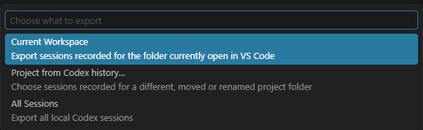
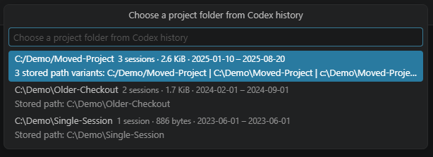
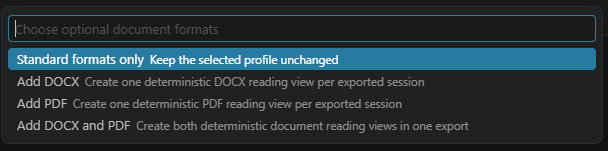
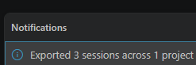

# Codex Project Chat Exporter for Visual Studio Code

Export local Codex project history from Visual Studio Code into independent, portable archives – including editable Word documents and searchable PDFs.

[](#requirements)
[](#tested-scope-and-limits)
[](LICENSE)
[](https://github.com/Ann-Diana/codex-project-chat-exporter/actions/workflows/test.yml)

<p>
  
</p>

> **Direct DOCX and PDF generation – locally, from the same readable document model, without Word, LibreOffice or cloud conversion.**

The extension is a guided local interface for the shared exporter core. It can export the current workspace, another project recorded in Codex history or every detected local session. Original Codex data remains unchanged.

## Requirements

- Visual Studio Code Desktop 1.101 or newer
- a trusted local VS Code window
- local Codex session data

The packaged VSIX includes the exporter runtime. No separate Node.js installation or office suite is required.

## Installation

The extension is distributed as a VSIX and is not published in the Visual Studio Code Marketplace.

1. Download the VSIX from a [published release](https://github.com/Ann-Diana/codex-project-chat-exporter/releases).
2. In VS Code Desktop, open Extensions with `Ctrl+Shift+X`.
3. Select `…`, then **Install from VSIX…**.
4. Choose the downloaded file and reload VS Code if prompted.

Terminal installation is also available:

```powershell
code --install-extension "C:\path\to\codex-project-chat-exporter-vscode-<version>.vsix" --force
```

## Export

Run **Codex Export: Export…** and choose:

1. **Scope** – Current Workspace, Project from Codex history… or All Sessions.
2. **Profile** – Complete export, Readable export or Source snapshots.
3. **Document formats** – standard formats only, DOCX, PDF or both.
4. **Output folder** – a local destination for the new export.

When a different recorded project path is selected, the extension asks for confirmation before continuing. Cancelling a picker creates no export and does not replace the last successful export state. The output folder is created only when an export actually starts.

### Scopes

- **Current Workspace** matches the open local folder against stored `cwd` metadata by exact path identity. It does not inspect arbitrary workspace files or fall back to fuzzy matching.
- **Project from Codex history…** selects an exact recorded path even when the former folder no longer exists.
- **All Sessions** includes all detected active and archived local sessions.

### Profiles and formats

- **Complete export** includes readable views, manifests, assets and verified Raw JSONL snapshots.
- **Readable export** includes readable views, manifests and assets without new Raw snapshots.
- **Source snapshots** preserves verified Raw JSONL with a reduced HTML index and no Markdown transcripts.

DOCX, PDF or both can be added to any profile. Both document formats are rendered directly from the shared document model; PDF is not converted from DOCX. Selected PNG and JPEG images appear inline and are also preserved in the deduplicated asset folder.

## Visual flow

1. Choose the export scope.

   

2. If needed, choose an exact project identity from Codex history.

   

3. Choose standard output, DOCX, PDF or both document formats.

   

4. Confirm the completed export and canonical project grouping.

   

## Settings

- **Output Directory** (`codexProjectChatExporter.outputDirectory`) – optional absolute local destination. If empty, the extension asks before export.
- **Codex Home** (`codexProjectChatExporter.codexHome`) – optional absolute local Codex data directory. If empty, the extension uses `CODEX_HOME` or the default `.codex` folder.
- **Path Style** (`codexProjectChatExporter.pathStyle`) – short Windows-friendly paths or longer readable names.
- **Include Tools** (`codexProjectChatExporter.includeTools`) – disabled by default; includes potentially sensitive Tool, Browser and `view_image` records plus selected assets in readable outputs. Raw JSONL remains unchanged.
- **Diagnostic Output** (`codexProjectChatExporter.diagnosticOutput`) – writes message-free, path-redacted timing information for a troubleshooting run.

Output Directory and Codex Home accept only absolute local paths. Web, remote, UNC and Windows device locations are rejected. A mapped drive can still be network-backed without being reliably identifiable as such.

## Commands

- **Codex Export: Export…**
- **Codex Export: Open Latest Export**
- **Codex Export: Open Export Folder**

The open commands use only the last successfully completed export and revalidate the local target before opening it.

## Privacy and safety

- No telemetry, uploader or application-level remote content fetch is included.
- The extension reads local Codex session stores and the configured session index, not arbitrary workspace files.
- Exports can contain private messages, usernames, paths, source code, tool output and attachments. Review every generated file before sharing.
- The output channel displays local export paths.
- Raw JSONL is source-faithful and is not automatically safe to share.
- Validated HTTP and HTTPS links may remain clickable without being fetched. Local, launch, JavaScript and other active targets are blocked in DOCX and PDF.

## Cancellation

The export progress notification is cancellable. A cancellation before publication leaves no regular result. If a multi-session or multi-format generation has already begun publishing, `EXPORT_INCOMPLETE.txt` can remain and invalidates the entire folder as a completed archive.

## Tested scope and limits

Manual acceptance covers local VS Code Desktop on Windows with local `file:` workspaces and local Codex session data. Remote and web Extension Hosts are not supported. Linux and macOS desktop use is not explicitly blocked, but manual acceptance is not claimed.

The extension does not import sessions, restore Codex UI state, export cloud-only tasks without local files or export ordinary ChatGPT web conversations. Raw snapshots remain private source material and require review before sharing.

## More information

- [Project README](https://github.com/Ann-Diana/codex-project-chat-exporter#readme)
- [FAQ](https://github.com/Ann-Diana/codex-project-chat-exporter/blob/main/FAQ.md)
- [Security policy](https://github.com/Ann-Diana/codex-project-chat-exporter/blob/main/SECURITY.md)
- [Archive format v1](https://github.com/Ann-Diana/codex-project-chat-exporter/blob/main/docs/archive-format-v1.md)
- [Packaged VSIX test plan](PACKAGED_TEST_PLAN.md)

## License

MIT – see [LICENSE](LICENSE).
